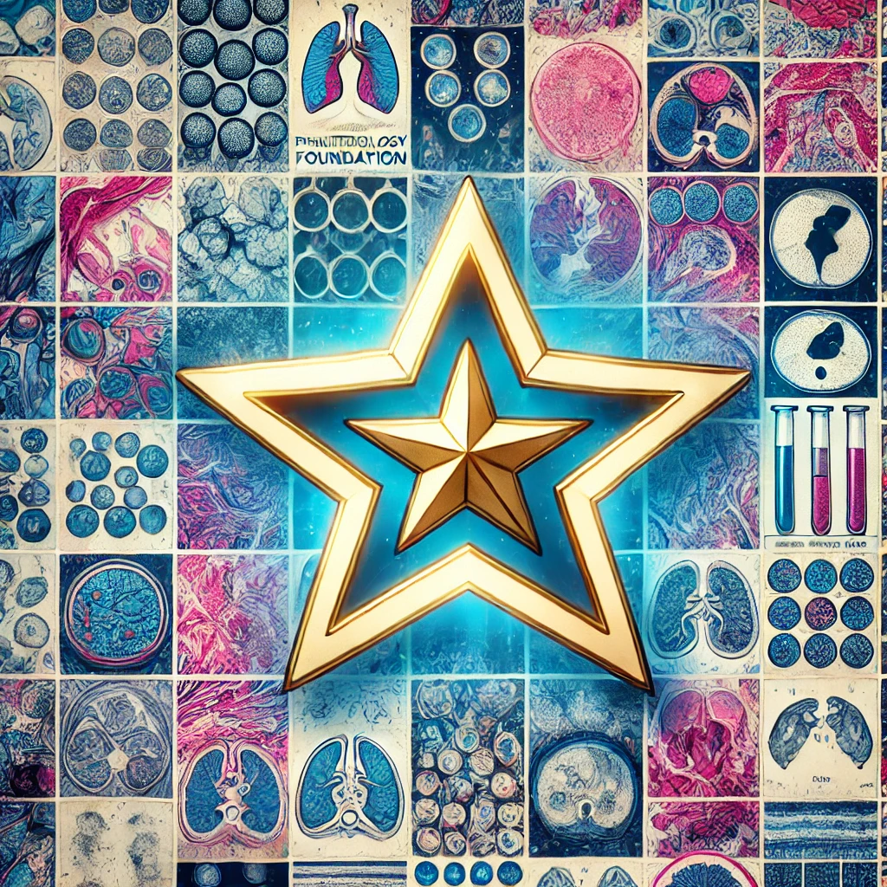
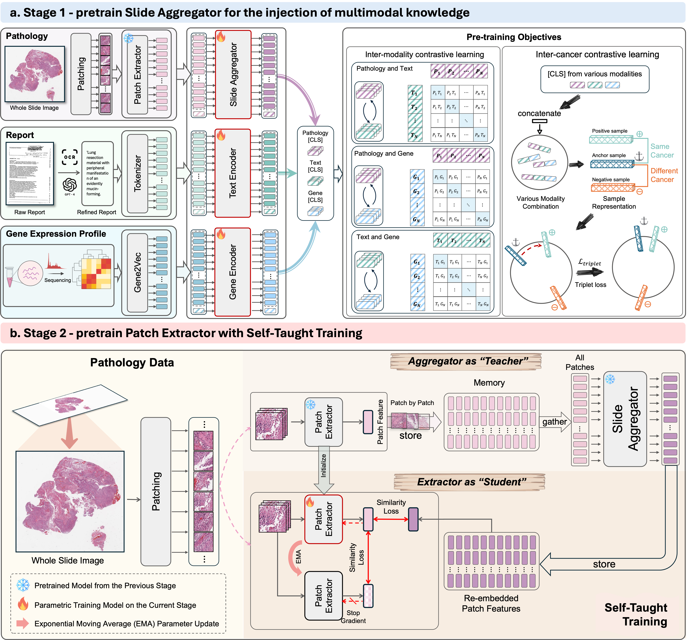

<!-- # mSTAR
## A Multimodal Knowledge-enhanced Whole-slide Pathology Foundation Model -->

[](https://arxiv.org/abs/2407.15362)

[](https://huggingface.co/Wangyh/mSTAR)
[](https://x.com/SMARTLab_HKUST)
--- 


**Abstract:** Remarkable strides in computational pathology have been made in the task-agnostic foundation model that advances the performance of a wide array of downstream clinical tasks. Despite the promising performance, there are still several challenges. First, prior works have resorted to either vision-only or vision-captions data, disregarding invaluable pathology reports and gene expression profiles which respectively offer distinct knowledge for versatile clinical applications. Second, the current progress in pathology FMs predominantly concentrates on the patch level, where the restricted context of patch-level pretraining fails to capture whole-slide patterns. Here we curated the largest multimodal dataset consisting of H\&E diagnostic whole slide images and their associated pathology reports and RNA-Seq data, resulting in 26,169 slide-level modality pairs from 10,275 patients across 32 cancer types. To leverage these data for CPath, we propose a novel whole-slide pretraining paradigm which injects multimodal knowledge at the whole-slide context into the pathology FM, called **M**ultimodal **S**elf-**TA**ught **PR**etraining (mSTAR). The proposed paradigm revolutionizes the workflow of pretraining for CPath, which enables the pathology FM to acquire the whole-slide context. To our knowledge, this is the first attempt to incorporate multimodal knowledge at the slide level for enhancing pathology FMs, expanding the modelling context from unimodal to multimodal knowledge and from patch-level to slide-level. To systematically evaluate the capabilities of mSTAR, extensive experiments including slide-level unimodal and multimodal applications, are conducted across 7 diverse types of tasks on 43 subtasks, resulting in the largest spectrum of downstream tasks. The average performance in various slide-level applications consistently demonstrates significant performance enhancements for mSTAR compared to SOTA FMs.

<!-- 
 -->
## Todo list
- [ ] Huggingface lib is under preparing  
- [ ] Downstream tasks are under preparing  

## Installation
First clone the repo and cd into the directory:

```bash
git clone https://github.com/Innse/mSTAR.git
cd mSTAR
```

To get started, create a conda environment containing the required dependencies:

```bash
conda env create -f mSTAR.yml
```
Activate the environment:
```bash
conda activate mSTAR
```

### Getting access of the model

Request access to the model weights from the 🤗Huggingface model page at: [https://huggingface.co/Wangyh/mSTAR](https://huggingface.co/Wangyh/mSTAR) (Note: under preparing)


### Creating model with downloaded weights

We use the ```timm``` library to define the ViT-L/16 model architecture. Pretrained weights and image transforms for mSTAR need to be manually loaded and defined.

```python
import timm
from torchvision import transforms
import torch
    
ckpt_path = 'where you store the mSTAR.pth file'
transform = transforms.Compose(
    [
        transforms.Resize(224),
        transforms.ToTensor(),
        transforms.Normalize(mean=(0.485, 0.456, 0.406), std=(0.229, 0.224, 0.225)),
    ]
)
model = timm.create_model(
    "vit_large_patch16_224", img_size=224, patch_size=16, init_values=1e-5, num_classes=0, dynamic_img_size=True
)
model.load_state_dict(torch.load(ckpt_path, map_location="cpu"), strict=True)
model.eval()
```
### Running Inference
You can use the mSTAR pretrained encoder to extract features from histopathology patches, as follows:

```python
from PIL import Image
image = Image.open("patch.png")
image = transform(image).unsqueeze(dim=0) 
feature_emb = model(image)
```
You can also try it in [tutorial.ipynb](https://github.com/Innse/mSTAR/blob/main/tutorial.ipynb).

Meanwhile, we provide the example showing how to conduct feature extract on Whole Slides Images based on [CLAM](https://github.com/mahmoodlab/CLAM).

In [Feature_extract/LUAD.sh](https://github.com/Innse/mSTAR/blob/main/Feature_extract/LUAD.sh), you need to set the ```DIR_TO_COORDS``` and ```DATA_DIRECTORY``` based on the directory you got from [CLAM](https://github.com/mahmoodlab/CLAM).
```bash
save_storage="yes"
models='mSTAR'
declare -A gpus
gpus['mSTAR']=0

CSV_FILE_NAME="./dataset_csv/LUAD.csv"

DIR_TO_COORDS="your own DIR_TO_COORDS"
DATA_DIRECTORY="your own DATA_DIRECTORY"

FEATURES_DIRECTORY="where you what to store the features"

datatype="tcga" 
ext=".svs"
for model in $models
do
        echo $model", GPU is:"${gpus[$model]}
        export CUDA_VISIBLE_DEVICES=${gpus[$model]}

        python extract_feature.py \
                --data_h5_dir $DIR_TO_COORDS \
                --data_slide_dir $DATA_DIRECTORY \
                --csv_path $CSV_FILE_NAME \
                --feat_dir $FEATURES_DIRECTORY \
                --batch_size 256 \
                --model $model \
                --datatype $datatype \
                --slide_ext $ext \
                --save_storage $save_storage
done
```


## Acknowledgements
The project was built on top of amazing repositories such as [UNI](https://github.com/mahmoodlab/UNIn), [CLAM](https://github.com/mahmoodlab/CLAM), [OpenCLIP](https://github.com/mlfoundations/open_clip),  and [Timm](https://github.com/huggingface/pytorch-image-models/) (ViT model implementation). We thank the authors and developers for their contribution. 


## Reference
If you find our work useful in your research or if you use parts of this code please consider citing our [paper](https://arxiv.org/abs/2407.15362):

Xu, Y., Wang, Y., Zhou, F., Ma, J., Yang, S., Lin, H., ... & Chen, H. (2024). A Multimodal Knowledge-enhanced Whole-slide Pathology Foundation Model. arXiv preprint arXiv:2407.15362.

```
@misc{xu2024multimodalknowledgeenhancedwholeslidepathology,
      title={A Multimodal Knowledge-enhanced Whole-slide Pathology Foundation Model}, 
      author={Yingxue Xu and Yihui Wang and Fengtao Zhou and Jiabo Ma and Shu Yang and Huangjing Lin and Xin Wang and Jiguang Wang and Li Liang and Anjia Han and Ronald Cheong Kin Chan and Hao Chen},
      year={2024},
      eprint={2407.15362},
      archivePrefix={arXiv},
      primaryClass={cs.CV},
      url={https://arxiv.org/abs/2407.15362}, 
}
```

If you have any question, feel free to email [Yingxue XU](yxueb@connect.ust.hk) and [Yihui WANG](ywangrm@connect.ust.hk).

----
 
