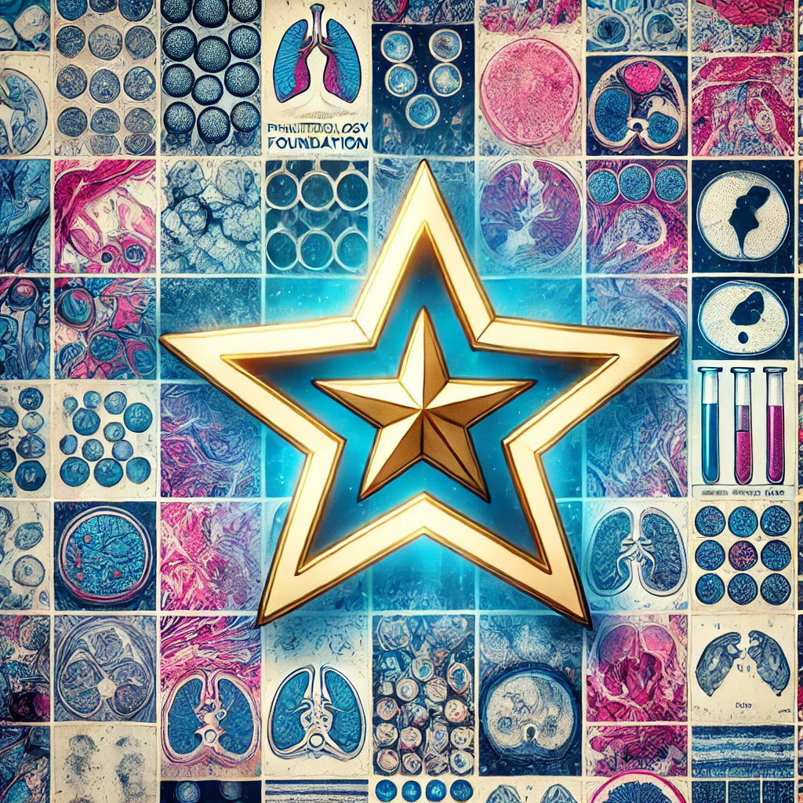
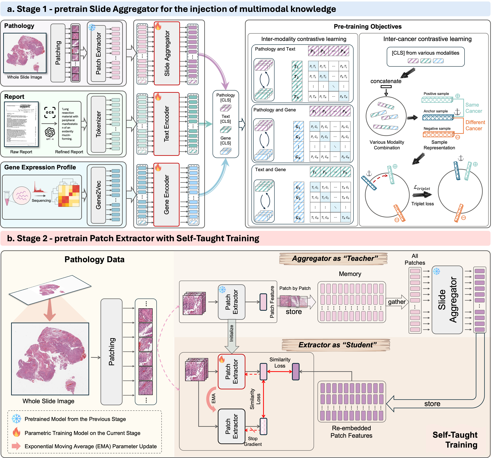

<!-- # mSTAR
## A Multimodal Knowledge-enhanced Whole-slide Pathology Foundation Model -->

[![Paper]](https://www.nature.com/articles/s41467-025-66220-x)
[](https://arxiv.org/abs/2407.15362)

[](https://huggingface.co/Wangyh/mSTAR)
[](https://x.com/SMARTLab_HKUST)
--- 


**Abstract:** Computational pathology has advanced through foundation models, yet faces challenges in multimodal integration and capturing whole-slide context. Current approaches typically utilize either vision-only or image-caption data, overlooking distinct insights from pathology reports and gene expression profiles. Additionally, most models focus on patch-level analysis, failing to capture comprehensive whole-slide patterns. Here we present mSTAR (\textbf{M}ultimodal \textbf{S}elf-\textbf{TA}ught P\textbf{R}etraining), the pathology foundation model that incorporates three modalities: pathology slides, expert-created reports, and gene expression data, within a unified framework. Our dataset includes 26,169 slide-level modality pairs across 32 cancer types, comprising over 116 million patch images. This approach injects multimodal whole-slide context into patch representations, expanding modeling from single to multiple modalities and from patch-level to slide-level analysis. Across oncological benchmark spanning 97 tasks, mSTAR outperforms previous state-of-the-art models, particularly in molecular prediction and multimodal tasks, revealing that multimodal integration yields greater improvements than simply expanding vision-only datasets.

<!-- 
 -->

## Installation
### OS Requirements
This repo has been tested on the following system and GPU:
- Ubuntu 22.04.3 LTS
- NVIDIA H800 PCIe 80GB


First clone the repo and cd into the directory:

```bash
git clone https://github.com/Innse/mSTAR.git
cd mSTAR
```

To get started, create a conda environment containing the required dependencies:

```bash
conda env create -f mSTAR.yml
```
Activate the environment:
```bash
conda activate mSTAR
```
## Usage
### Getting access of the model

Request access to the model weights from the 🤗Huggingface model page at: [https://huggingface.co/Wangyh/mSTAR](https://huggingface.co/Wangyh/mSTAR)


### Creating model with downloaded weights

We use the ```timm``` library to define the ViT-L/16 model architecture. Pretrained weights and image transforms for mSTAR need to be manually loaded and defined.

```python
import timm
from torchvision import transforms
import torch
    
ckpt_path = 'where you store the mSTAR.pth file'
transform = transforms.Compose(
    [
        transforms.Resize(224),
        transforms.ToTensor(),
        transforms.Normalize(mean=(0.485, 0.456, 0.406), std=(0.229, 0.224, 0.225)),
    ]
)
model = timm.create_model(
    "vit_large_patch16_224", img_size=224, patch_size=16, init_values=1e-5, num_classes=0, dynamic_img_size=True
)
model.load_state_dict(torch.load(ckpt_path, map_location="cpu"), strict=True)
model.eval()
```
### Running Inference
You can use the mSTAR pretrained encoder to extract features from histopathology patches, as follows:

```python
from PIL import Image
image = Image.open("patch.png")
image = transform(image).unsqueeze(dim=0) 
feature_emb = model(image)
```
You can also try it in [tutorial.ipynb](tutorial.ipynb).
### Feature extractor for WSIs
Meanwhile, we provide the example showing how to conduct feature extract on [TCGA-LUSC](https://portal.gdc.cancer.gov/projects/TCGA-LUSC) based on [CLAM](https://github.com/mahmoodlab/CLAM).

In [Feature_extract/LUSC.sh](Feature_extract/LUSC.sh), you need to set the following directories:

- DATA_DIRECTORY: This should be set to the directory which contains the WSI data.
- DIR_TO_COORDS: This should be set to the directory that contains the coordinate information for the WSI patches preprocessed through [CLAM](https://github.com/mahmoodlab/CLAM).
- FEATURES_DIRECTORY: This is the directory where you want to store the extracted features. 
```bash
models='mSTAR'
declare -A gpus
gpus['mSTAR']=0

CSV_FILE_NAME="./dataset_csv/LUSC.csv"

DIR_TO_COORDS="path/DIR_TO_COORDS"
DATA_DIRECTORY="path/DATA_DIRECTORY"

FEATURES_DIRECTORY="path/features"

ext=".svs"
for model in $models
do
        echo $model", GPU is:"${gpus[$model]}
        export CUDA_VISIBLE_DEVICES=${gpus[$model]}

        python extract_feature.py \
                --data_h5_dir $DIR_TO_COORDS \
                --data_slide_dir $DATA_DIRECTORY \
                --csv_path $CSV_FILE_NAME \
                --feat_dir $FEATURES_DIRECTORY \
                --batch_size 256 \
                --model $model \
                --slide_ext $ext
done
```
For more details about feature extraction, please check [here](Feature_extract/README.md)

## Downstream Task
We currently support the following downstram task:
- [Slide-level Diagnostic Tasks](downstream_task/diagnosis_preidction)
- [Molecular Prediction](downstream_task/molecular_prediction)
- [Cancer Survival Prediction](downstream_task/survival_prediction)
- [Multimodal Survival Analysis](downstream_task/multimodal_survival)
- [Few-shot Slide Classification](downstream_task/fewshot_classification)
- [Zero-shot Slide Classification](downstream_task/zeroshot_classification)
- [Report Generation](downstream_task/report_generation)

Here is a simple demo on how to conduct cancer survival prediction on TCGA-LUSC
```
cd downstream_task/survival_prediction
```
The feature directory should look like:
```
TCGA-LUSC
  └─pt_files
      └─mSTAR
        ├── feature_1.pt
        ├── feature_2.pt
        ├── feature_3.pt
        └── ...

```
You need to specify the path of the feature directory and choose the model. After you have completed all the settings, you can run the following commands.
```bash
feature_path='/feature_path' #change here
studies='LUSC'
models='AttMIL'
features='mSTAR'
lr=2e-4
# ckpt for pretrained aggregator
# aggregator='aggregator'
# export WANDB_MODE=dryrun
cd ..
for feature in $features
do
    for study in $studies
    do
        for model in $models
        do
            CUDA_VISIBLE_DEVICES=0 python main.py --model $model \
                                                --csv_file ./dataset_csv/${study}_Splits.csv \
                                                --feature_path $feature_path \
                                                --study $study \
                                                --modal WSI \
                                                --num_epoch 30 \
                                                --batch_size 1 \
                                                --lr $lr \
                                                --feature $feature \
        done
    done
done

```

The total time to run this demo may take around **10** mins for AttMIL. For more details about survival prediction, please check [here](downstream_task/survival_prediction/README.md)

## Acknowledgements
The project was built on top of amazing repositories such as [UNI](https://github.com/mahmoodlab/UNIn), [CLAM](https://github.com/mahmoodlab/CLAM) and [OpenCLIP](https://github.com/mlfoundations/open_clip). We thank the authors and developers for their contribution. 


## Reference
If you find our work useful in your research or if you use parts of this code please consider citing our [paper](https://www.nature.com/articles/s41467-025-66220-x):

Xu Y, Wang Y, Zhou F, et al. A multimodal knowledge-enhanced whole-slide pathology foundation model[J]. Nature Communications, 2025.

```
@article{xu2025multimodal,
  title={A multimodal knowledge-enhanced whole-slide pathology foundation model},
  author={Xu, Yingxue and Wang, Yihui and Zhou, Fengtao and Ma, Jiabo and Jin, Cheng and Yang, Shu and Li, Jinbang and Zhang, Zhengyu and Zhao, Chenglong and Zhou, Huajun and others},
  journal={Nature Communications},
  year={2025},
  publisher={Nature Publishing Group UK London}
}
```

## License and Terms of Tuse

ⓒ SmartLab. This model and associated code are released under the [CC-BY-NC-ND 4.0]((https://creativecommons.org/licenses/by-nc-nd/4.0/deed.en)) license and may only be used for non-commercial, academic research purposes with proper attribution. Any commercial use, sale, or other monetization of the mSTAR model and its derivatives, which include models trained on outputs from the mSTAR model or datasets created from the mSTAR model, is prohibited and reguires prior approval.


If you have any question, feel free to email [Yingxue XU](yxueb@connect.ust.hk) and [Yihui WANG](ywangrm@connect.ust.hk).

----
 
